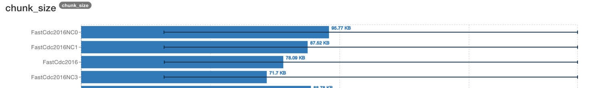
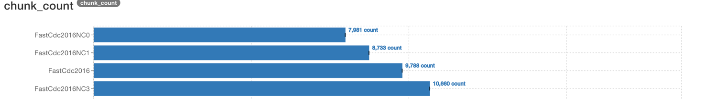
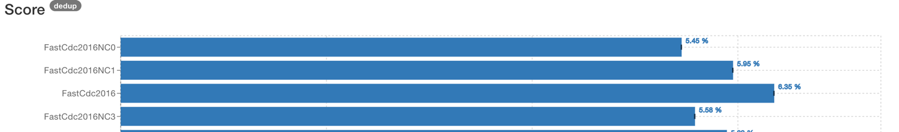

# Results

## Chunkers

### FastCDC

1. 2020 gives slightly better deduplication ratio than 2016 on all chunk sizes.
2. FastCDC produces fewer but bigger chunks. Ronomon/StadiaCDC chunks are closer to the avg.
3. Increasing NC decreases chunk sizes and increases their count, and vice versa.
However, the deduplication ratio is the best at the default NC2, even though NC3 emits more chunks.

### StadiaCDC

1. Favors `0.5*avg/avg/<=2*avg` in terms of deduplication.

### Ronomon

1. Ronomon/ronomon64 produce chunks with sizes that are close to the average. There is a shift towards max for the 2MB/4MB avg.
The number of chunks is :
- 1.4k at 512KB
- 11.5k at 64KB

2. NC2/3 give smaller chunks. 
The number of chunks:
- 1.8k and 2.2k at 512KB respectively
- 15k and 18k at 64KB respectively
- for comparison, RC1 (default) produces 23k chunks for 32KB avg.

The bigger number of chunks is likely caused by the fact that Ronomon uses an [adaptive](https://github.com/nlfiedler/fastcdc-rs/blob/master/src/ronomon/mod.rs#L233-L244) 
threshold for switching to the less strict mask faster.

3. Deduplication ratio is almost the same for all the min/avg/max proportions, except `0.75*avg/avg/1.5*avg`.
The ratio decreases from roughly 7.5% to 6.6% for these min/max chunks sizes. 

4. The 64 bit digest performs the same as 32 bit.

### Buz

1. Best deduplication ratio is for the Buzhash32  with regression and `64`/`128` byte windows, especially with chunk sizes `0.25*avg/avg/4*avg`.
Admittedly, this deduplication ratio comes at a cost of having the biggest number of chunks.
2. For Buzhash64 `256` bit window with regression shows the best deduplication.
3. These groups of windows work similarly:
- 32 bit for 48/96 window
- 32 bit for 64/128 window
- 64 bit for 32/48/96/min_chunk window
- 64 bit for 64/128/256/512 window
4. `min_chunk` without regression gives the worst deduplication ratios.
It is then preferable to avoid using `min_chunk` as a window size to skip bytes that would otherwise need to be hashed. 
5. Regression lets the algorithm produce more and smaller chunks with better deduplication. 
6. 64-bit hash gives up to 10% fewer chunks for the same window/chunk sizes. Deduplication is similar.
The chunk sizes are closer to the desired average sizes with 64-bit hash.

### Casync

1. Even though the time measurement are not precise in this benchmark, it is clearly visible that the predicate 
that Casync uses almost doubles the execution time.

2. The `0.25*avg/avg/4*avg` is the default chunk distribution that is used in Casync, 
and it indeed gives the best deduplication ratio across all chunk sizes.

### Restic

1. The default `2*avg/avg/8*avg` doesn't give the best deduplication even for the default `avg=1MB`.
2. Chunk sizes are close to the configured average sizes, especially for `avg>=512KB` and `2*avg/avg/8*avg`.

## Chunk sizes

1. `0.25*avg/avg/4*avg` gives better deduplication ratios for a wide variety of algorithms.
2. Min size `0.75*avg` decreases deduplication for all chunker algorithms.
